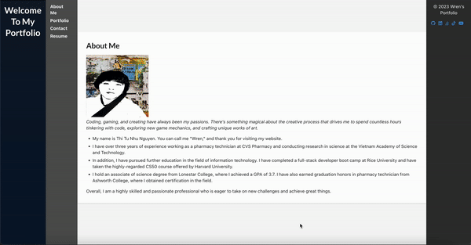

# React Apps Portfolio
The React Apps Portfolio is a showcase of various React applications that I have developed. It serves as a central hub where I can display my projects, provide information about each application, and demonstrate my skills as a React developer.

## Table of Contents
Getting Started
Available Scripts
Learn More
Code Splitting
Analyzing the Bundle Size
Making a Progressive Web App
Advanced Configuration
Deployment
Troubleshooting
## Getting Started

This project was bootstrapped with Create React App. It provides a quick and easy way to set up a new React application.

To get started with this project, follow the instructions below.

Clone the repository to your local machine.

git clone https://github.com/nhunguyen-debug/REACT-APPS.git
Install the dependencies by running the following command in the project directory.

bash

npm install
Start the development server with the following command.

bash

npm start
Open http://localhost:3000 in your browser to view the application.

## Available Scripts
In the project directory, you can run the following scripts:

npm start
Runs the app in the development mode.
Open http://localhost:3000 to view it in your browser.

The page will reload when you make changes.
You may also see any lint errors in the console.

npm test
Launches the test runner in the interactive watch mode.
See the section about running tests for more information.

npm run build
Builds the app for production to the build folder.
It correctly bundles React in production mode and optimizes the build for the best performance.

The build is minified and the filenames include the hashes.
Your app is ready to be deployed!

See the section about deployment for more information.

npm run eject
Note: this is a one-way operation. Once you eject, you can't go back!

If you aren't satisfied with the build tool and configuration choices, you can eject at any time. This command will remove the single build dependency from your project.

Instead, it will copy all the configuration files and the transitive dependencies (webpack, Babel, ESLint, etc.) right into your project so you have full control over them. All of the commands except eject will still work, but they will point to the copied scripts so you can tweak them. At this point, you're on your own.

You don't have to ever use eject. The curated feature set is suitable for small and middle deployments, and you shouldn't feel obligated to use this feature. However, we understand that this tool wouldn't be useful if you couldn't customize it when you are ready for it.

## Learn More
To learn more about Create React App, you can refer to the official documentation.

To learn React, check out the React documentation.

### Code Splitting
This section has moved [here](https://create-react-app.dev/docs/code-splitting/)
.

### Analyzing the Bundle Size
This section has moved here.[here](https://create-react-app.dev/docs/analyzing-the-bundle-size/).

### Making a Progressive Web App
This section has moved [here](https://create-react-app.dev/docs/making-a-progressive-web-app/).
### Advanced Configuration
This section has moved [here](https://create-react-app.dev/docs/advanced-configuration/).

### Deployment
This section has moved [here](https://create-react-app.dev/docs/deployment/). 

This is my github link for this project: https://github.com/nhunguyen-debug/REACT-APPS.git 
This is heroku link:  https://react-app-wren-4649eb97664e.herokuapp.com/ 
 
This is link github: https://github.com/nhunguyen-debug/REACT-APPS.git
### Troubleshooting
If you encounter any issues with the npm run build command failing to minify, refer to the troubleshooting guide here.https://create-react-app.dev/docs/troubleshooting/#npm-run-build-fails-to-minify 
